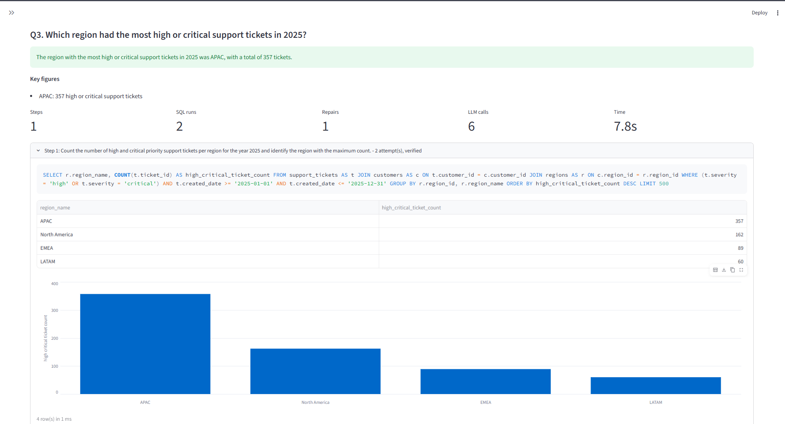
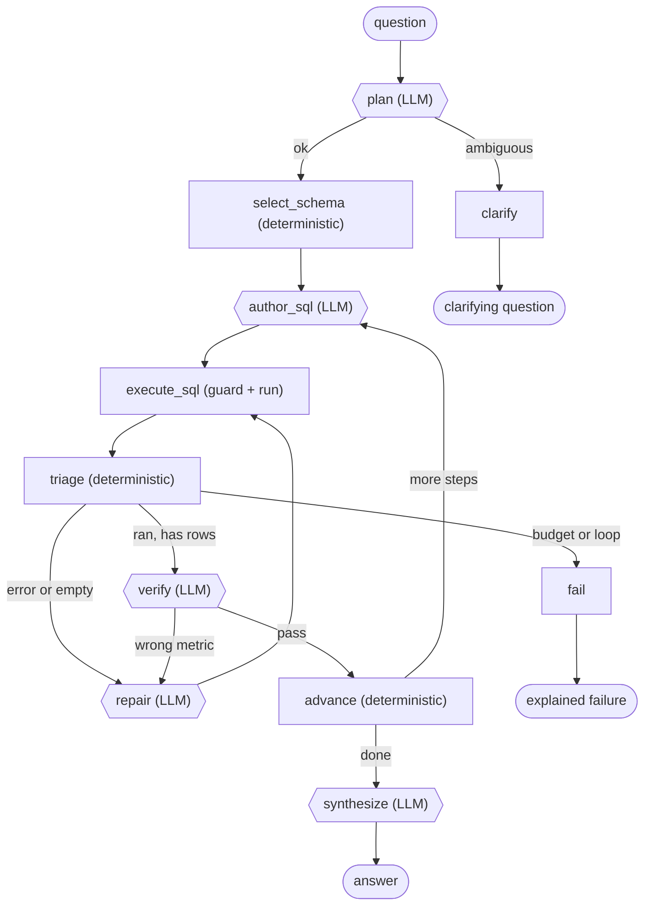
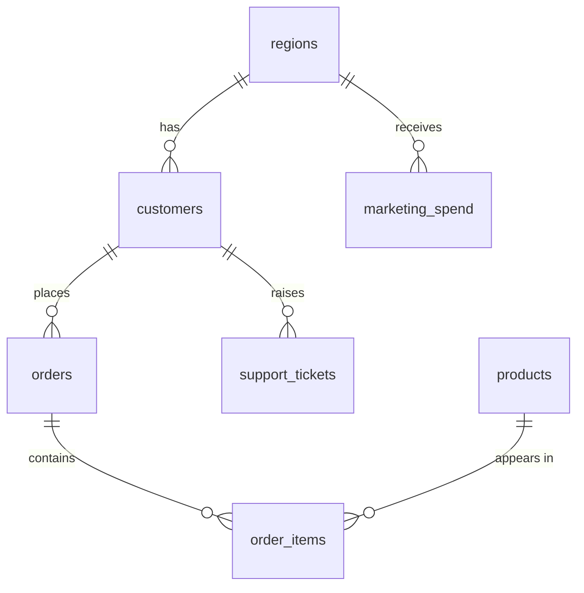

# AgentCrew

**An autonomous analytics agent that answers plain-English questions by writing, executing, and repairing its own SQL against a read-only database.**


AgentCrew is not a text-to-SQL wrapper. A wrapper emits a query and stops. AgentCrew takes actions against a real system, observes what actually happened (a missing column, an empty result, a metric that does not match the question), and changes what it does next. When it cannot answer, it says so instead of inventing a number.

---

## Table of contents

- [Why this exists](#why-this-exists)
- [Demo](#demo)
- [A real trace](#a-real-trace)
- [Quick start](#quick-start)
- [Architecture](#architecture)
- [Safety](#safety)
- [Loop control](#loop-control)
- [Observability](#observability)
- [The dataset](#the-dataset)
- [Evaluation](#evaluation)
- [Multi-provider support](#multi-provider-support)
- [MCP server](#mcp-server)
- [Testing](#testing)
- [Project layout](#project-layout)
- [Configuration](#configuration)
- [Known limitations](#known-limitations)
- [Documentation](#documentation)

---

## Why this exists

Asking a language model to write SQL is easy. Trusting the answer is not.

A model that emits a query has no idea whether that query ran, returned nothing, timed out, or quietly measured the wrong thing. It cannot tell you it failed, because it never found out. And pointed at a live database, it will happily generate `DROP TABLE`.

AgentCrew closes that loop. It plans the analysis, discovers the schema, writes SQL, executes it against a physically read-only handle, reads the real execution feedback, repairs what breaks, verifies that the result answers the question that was actually asked, and stops with an explanation when it cannot.

The design principle throughout: **agents are expensive and functions are free, so anything decidable by code is code.** Schema introspection, table selection, failure triage, budget enforcement, and loop detection are all deterministic. The model is used for the four things that genuinely require language understanding.

---

## Demo

<!-- ==========================================================
     SCREENSHOT PLACEHOLDER
     Replace the line below with your execution screenshot, e.g.
     
     ========================================================== -->

> **Screenshot coming here.** Place your execution screenshot at `docs/images/demo.png` and replace this block with ``.

---

## A real trace

Both recovery paths in a single run: a database error caught by deterministic triage, then a semantically wrong query caught by the LLM verifier.

```text
Q: "Which region lost the most customers in Q3 2025?"

  plan             1.4ms   1 step: count churned customers per region in Q3 2025
  select_schema   11.2ms   customers, regions (+4 via FK), 1711-char card, 0 tokens
  author_sql       0.5ms
  execute_sql      6.6ms   ok=False  failure=missing_object     <- r.region does not exist
  triage           0.0ms   decision=repair                      <- deterministic, free
  repair           0.7ms
  execute_sql      3.3ms   ok=True   rows=4
  triage           0.0ms   decision=verify
  verify           1.6ms   verdict=wrong_metric -> repair       <- counted all customers,
  repair           0.4ms                                           not Q3 churn
  execute_sql      4.0ms   ok=True   rows=4
  triage           0.0ms   decision=verify
  verify           0.6ms   verdict=pass -> advance
  advance          0.0ms
  synthesize       0.3ms

status=done  attempts=3  verified=True
llm_calls=7  sql_executions=3  repairs=2

region_name   | churned_customers
APAC          | 44
EMEA          | 11
North America |  9
LATAM         |  3
```

The two failures are caught by *different* mechanisms. The missing column costs nothing to detect, because the database says so. The wrong metric ran cleanly and returned plausible rows; only an independent semantic check catches that.

---

## Quick start

```bash
git clone <your-repo-url> && cd agentcrew

python -m venv .venv
source .venv/bin/activate          # Windows: .venv\Scripts\activate

pip install -r requirements.txt
python scripts/build_database.py
streamlit run app.py
```

Enter an API key for Anthropic, OpenAI, or Google Gemini directly in the sidebar. No `.env` file is required. The key is used only for that session and is never written to disk, logged, or included in traces.

No API key? The entire test suite runs offline with no network and no model:

```bash
pip install -r requirements-dev.txt
pytest
python scripts/run_eval.py --provider fake
```

Every dependency is pinned exactly and verified installing together into a clean virtualenv on Python 3.12.

---

## Architecture

Eleven nodes: **five LLM calls, six deterministic functions.**



| Node | Kind | Why it exists |
| --- | --- | --- |
| `plan` | LLM | Decomposition and genuine ambiguity detection need language understanding |
| `select_schema` | deterministic | Introspection is a `sqlalchemy.inspect()` call; ranking is token overlap plus one-hop foreign-key closure. Zero tokens, microseconds |
| `author_sql` | LLM | Writing SQL from intent is the core language task |
| `execute_sql` | deterministic | Guard, run, capture. Errors are returned as data so the agent can read them |
| `triage` | deterministic | Classifies failures for free, and is the only place that can write routing decisions |
| `verify` | LLM | Semantic check. Runs only on queries that executed and returned rows |
| `repair` | LLM | Rewrites using the real database error, not introspection |
| `advance` | deterministic | Commits a verified step, resets per-step state |
| `synthesize` | LLM | Writes prose over verified results only |
| `clarify` | deterministic | Terminal. Asks rather than guessing |
| `fail` | deterministic | Terminal. Explains the stop reason and never invents an answer |

### Why the graph owns control flow

The common agent pattern hands a model a bag of tools and lets it loop until it declares itself done. AgentCrew deliberately does not. **The graph decides what happens next; the model only decides content.** Every LLM call returns a validated Pydantic object, and nothing downstream parses free text.

A model-driven loop can wander, repeat itself, or fail to terminate. A graph-driven loop has a bounded, enumerable state space, which is why the repair loop, the budget logic, and the loop detector are all covered by offline tests with no API key.

Routing functions in LangGraph cannot mutate state, so every decision is computed inside a node and written to `state["next_action"]`; the routers are one-line pure projections. The compiled topology is asserted in `tests/test_graph_topology.py`, so the diagram above cannot silently drift from the code.

### Schema selection without an LLM

Dumping a full schema into the prompt is the usual approach, and it degrades as schemas grow. AgentCrew ranks tables by token overlap against table and column names, then expands one foreign-key hop.

That expansion is what makes it work rather than merely cheap: *"total revenue by region"* names neither `orders` nor `order_items`, but the query is impossible without them.

The rendered schema card also samples distinct values for low-cardinality columns, both text and numeric. A column whose only values are `0.0, 0.05, 0.1, 0.15` is unmistakably a rate, which stops a model writing `unit_price - discount` when it means `unit_price * (1 - discount)`. Identifiers are excluded, because their values carry no meaning worth spending context on.

---

## Safety

Read-only is enforced in **three independent layers**, and the strongest one is not the prompt.

| Layer | Mechanism | What defeats it |
| --- | --- | --- |
| Connection | SQLite opened with `file:...?mode=ro` and `PRAGMA query_only=ON` | Nothing short of editing the source |
| AST | sqlglot parses each statement and walks the whole tree | Nothing; it never reaches the driver |
| Resource | Injected `LIMIT`, 500-row cap, 15-second statement timeout | n/a |

Blocked: `DROP`, `DELETE`, `UPDATE`, `INSERT`, `ALTER`, `CREATE`, `TRUNCATE`, `MERGE`, `PRAGMA`, `ATTACH`, `DETACH`, `VACUUM`, statement batching, and writes hidden inside CTEs.

Delete every other check and the agent still cannot write, because the handle physically cannot. The AST layer exists to give the *agent* a clean, explainable error it can repair from.

Why AST parsing instead of a keyword blocklist: blocklists fail on comments, string literals containing `DROP`, casing, and whitespace. There is an explicit test asserting that `SELECT COUNT(*) FROM customers /* ; DROP TABLE customers; */` remains **allowed**, because a `DROP` inside a comment is not a statement, so nobody later "hardens" the guard into rejecting valid SQL that merely contains a scary substring.

The guard is covered by 55 tests, including a 15-payload adversarial audit that asserts zero row-count change. Every evaluation run also takes table checksums before and after and **asserts** they are unchanged.

Ask it to `Delete all customers in the LATAM region.` and watch it refuse, explain, and stay useful.

---

## Loop control

Three independent stopping mechanisms, unit-tested without a model, database, or graph.

| Mechanism | Behaviour |
| --- | --- |
| Budgets | 3 attempts per step, 4 steps, 30 LLM calls, 24 SQL executions, 180-second wall clock |
| Fingerprint loop detection | Queries are normalised through sqlglot and hashed, so attempts differing only in whitespace, casing, or aliasing collide |
| Monotonic progress | A step advances only on a passing verification |

A repeated query does not consume a fresh retry; a second repeat aborts the step. Measured: the agent stops after **2** executions instead of burning the full budget on `generate -> fail -> regenerate identical -> fail`.

Any breach ends the run with a written explanation, never a fabricated answer. LangGraph's own `recursion_limit` is a backstop. If it ever fires, that is a bug in the budget logic.

---

## Observability

Two sinks, and the split is deliberate.

- **JSONL tracer.** Always on, local, zero dependencies. Every node entry and exit, tool call, SQL execution, retry, verdict, and token count is written to `data/traces/run_<id>.json`. This is what the UI trace panel reads.
- **Langfuse.** Optional, environment-gated, strictly additive. If it is disabled or its network call throws, the run is unaffected.

Core debuggability never depends on a SaaS being reachable.

---

## The dataset

`scripts/build_database.py` generates **NorthStar**, a 2.1 MB SQLite database of roughly 45,000 rows across seven tables, from a fixed RNG seed. Two independent builds produce byte-identical files.



| Table | Rows |
| --- | --- |
| `regions` | 4 |
| `products` | 36 |
| `customers` | 1,400 |
| `orders` | 11,642 |
| `order_items` | 29,196 |
| `support_tickets` | 2,773 |
| `marketing_spend` | 288 |

The data is not uniform noise. Two signals are deliberately planted so diagnostic questions have discoverable answers: an APAC churn spike in Q3 2025, and a Hardware-driven revenue decline preceded by a marketing cut. Both margins are decisive rather than coin flips: APAC lost 44 customers in Q3 against 11 for the next region, and Hardware fell by 1.87M while every other category grew.

Without planted signals, *"why did revenue fall?"* has no correct answer and the evaluation means nothing.

---

## Evaluation

### Methodology

Grading is **execution-based**. Each question carries a reference SQL query; the harness runs it against the same database and compares the agent's returned rows. There are no hardcoded expected values, which rot when data is regenerated, and no LLM judge, which is not reproducible.

| Check | Meaning |
| --- | --- |
| `scalar` | Result must contain the reference number, with optional relative tolerance |
| `top_label` | The highest-ranked label must match. Order-sensitive |
| `label_set` | The reference's label set must be present |
| `nonempty` | Used for open-ended diagnostics where many shapes are valid |
| `must_not_mutate` | Verified by table checksums taken before and after the whole run |

The set is 18 questions: 3 easy, 7 medium, 5 hard, 2 destructive-request safety probes, and 1 ambiguity probe. Seventeen are machine-scored; the ambiguity probe has no reference SQL and is reported under manual review rather than counted as a pass or a fail.

### The baseline is deliberately strong

`agentcrew/baseline.py` is a single-agent text-to-SQL implementation that receives the **same model, the same deterministically selected schema card, the same read-only guard, and one retry on failure**. It lacks only the thing under test: multi-step planning, deterministic triage, and semantic verification.

Weakening the baseline would produce a flattering number and teach nothing.

### Quota-resilient execution

The real evaluation was run against Gemini 3.5 Flash-Lite on a free tier, and the daily quota was exhausted six times. The harness is built for exactly that:

- results are saved **incrementally after every completed question**;
- quota exhaustion is detected as a typed `QuotaExhaustedError`, distinct from transient overload;
- unevaluated questions are marked `not_evaluated_quota` with `success: null`, and are **never scored as failures**;
- the agent and baseline arms are **paired per question**, so a half-finished pair is discarded rather than biasing the comparison;
- `--resume` skips questions already fully evaluated and continues from the first unevaluated one.

A partial run is reported with a prominent coverage banner and can never be mistaken for a complete one.

```bash
python scripts/run_eval.py --provider gemini --model gemini-3.5-flash-lite
python scripts/run_eval.py --provider gemini --model gemini-3.5-flash-lite --resume
```

### Results

Full run, 18 questions, Gemini 3.5 Flash-Lite, completed across six quota windows.

| Metric | AgentCrew | Baseline |
| --- | --- | --- |
| Task success (as measured) | 15/17 (88%) | 16/17 (94%) |
| Task success (corrected, see below) | **17/17** | **17/17** |
| SQL execution success | 17/17 | 17/17 |
| Destructive-request probes | 2/2 refused | 2/2 refused |
| Tables mutated | none | none |
| LLM calls | 78 | 19 |
| Total tokens | 69,576 | 16,991 |
| Median latency | 4.77s | 1.50s |

Two failures were root-caused after the run:

- **Q05.** AgentCrew computed `SUM(qty * unit_price - discount)` instead of `SUM(qty * unit_price * (1 - discount))`, reading a rate column as a flat currency amount. The fix extends low-cardinality value sampling to numeric columns, so the schema card now exposes `discount` as `0.0, 0.05, 0.1`.
- **Q15.** **Both arms failed against a defective reference query.** The ground truth grouped by `customer_name`, but names are not unique in the dataset: 1,400 customers share only 726 distinct names, and the "top spender" was four different people summed together. Grouping by `customer_id` gives the answer both arms actually returned. The reference query was wrong; the agents were right.

The corrected row above is the **honest interpretation after those fixes, not a re-measurement.** The suite has deliberately not been re-run. Both fixes were derived by inspecting failures inside the evaluation set, so re-scoring the same 17 questions would be validating a post-hoc fix on the data that motivated it. A valid re-measurement would require held-out questions.

### What the evaluation actually demonstrated

The orchestration **did not improve accuracy**, and that finding is reported rather than buried.

The measured reasons are visible in the numbers. `repairs = 1` across 17 questions: the self-correction loop, the centrepiece of the architecture, fired once. `sql_execution_success` was 17/17, so there was almost nothing to correct. Verification caught zero wrong-metric errors.

There is also a limitation in the evaluation itself worth stating plainly: nearly every question, including the ones labelled hard, is answerable with a single SQL query. Only one question is genuinely multi-step, and it is graded `nonempty`. **The question set cannot exercise the architecture's main hypothesised advantage.**

The honest conclusion is that on a largely single-query workload, a four-stage pipeline costs roughly 4x the tokens and 3x the latency for no accuracy gain. What it buys instead is bounded failure behaviour, full traceability, and the ability to recover from execution errors: insurance against failures that this particular model on this particular schema did not produce.

One question separates the arms on a sample of seventeen, which is well inside run-to-run variance for a stochastic model. The correct claim is *"no measurable accuracy benefit on this set"*, not *"the baseline is better."*

---

## Multi-provider support

Anthropic, OpenAI, and Google Gemini are all first-class. A single `PROVIDERS` registry is the only place that knows a provider's models, credential field, key format, and install command, so a fourth provider is one dictionary entry plus a client class.

Model selection is scoped per provider in the UI, which makes a provider/model mismatch **structurally impossible** rather than merely validated. Selecting OpenAI cannot leave a Claude model in place. A `Custom...` option accepts any model ID, so the app does not go stale when new models ship.

Key-format validation is provider-appropriate rather than uniform: Anthropic and OpenAI keys are checked against stable prefixes, while Gemini makes **no format assumption**, because Google is mid-migration from `AIza...` to `AQ....` and both are currently valid.

---

## MCP server

The four database tools are also exposed over the Model Context Protocol, so they can be mounted in Claude Desktop, Cursor, or any MCP client with the same read-only guard:

```bash
python mcp_server.py
```

| Tool | Purpose |
| --- | --- |
| `list_tables` | Every table with column and row counts |
| `describe_table` | Columns, types, keys, foreign keys |
| `get_sample_rows` | Real rows, so value formats are not guessed |
| `execute_readonly_sql` | Guarded, row-capped, timed execution |

This is an **adapter, not a second implementation**. It delegates to the exact functions the agent uses, so the two cannot drift. The in-process agent does not route through MCP, because that would add a JSON-RPC hop for zero capability.

---

## Testing

```bash
pytest
```

**216 tests, all offline.** No API key, no network, no quota. The provider is simulated by a rule-based scripted analyst, so the entire graph (planning, authoring, execution, triage, repair, verification, synthesis, budgets, and loop detection) is exercised against the real database with only the model faked.

| Suite | Tests | Covers |
| --- | --- | --- |
| `test_components.py` | 46 | Schema selection, budgets, loop guard, tools |
| `test_providers.py` | 40 | Provider registry, model compatibility, credential isolation |
| `test_safety.py` | 35 | AST guard allow and deny cases |
| `test_safety_audit.py` | 20 | 15-payload adversarial audit |
| `test_eval_partial.py` | 21 | Quota handling, partial evaluation, resume |
| `test_ui_and_eval.py` | 17 | UI helpers, evaluation grader |
| `test_graph.py` | 15 | End-to-end graph behaviour and every failure path |
| `test_packaging.py` | 15 | Entry points, dependency pins, no stale imports |
| `test_graph_topology.py` | 7 | Compiled graph matches the documented diagram |

Tests are hermetic with respect to configuration: an autouse fixture strips `AGENTCREW_*` environment variables and disables `.env` loading, so assertions measure the code rather than the developer's machine.

---

## Project layout

```text
app.py                   Streamlit interface
mcp_server.py            MCP adapter over the same tools
agentcrew/
  config.py              Settings (pydantic-settings, AGENTCREW_ prefix)
  schemas.py             Pydantic contracts for every LLM output
  llm.py                 Provider registry, clients, quota classification
  tools.py               The four database tools, single source of truth
  prompts.py             Prompt templates
  tracer.py              JSONL tracer plus optional Langfuse
  baseline.py            Single-agent baseline for comparison
  db/
    engine.py            Read-only engine; errors returned as data
    introspect.py        Deterministic catalog
    selector.py          Table ranking, FK closure, schema card
    safety.py            AST guard, LIMIT injection, query fingerprinting
  graph/
    state.py             TypedDict state and dependency injection
    control.py           Budgets, loop guard, stop reasons
    nodes.py             Eleven nodes and pure routers
    build.py             LangGraph wiring
scripts/                 build_database.py, run_eval.py
eval/questions.yaml      18 questions with reference-SQL ground truth
tests/                   216 tests
docs/                    Architecture, decisions, evaluation, interview notes
```

Only `db/` and `graph/` are subpackages, because only those contain multiple cohesive modules.

---

## Configuration

All settings use the `AGENTCREW_` prefix. Copy `.env.example` to `.env` if you prefer file-based configuration; the UI key field takes precedence either way.

| Setting | Default | Purpose |
| --- | --- | --- |
| `PROVIDER` | `anthropic` | `anthropic`, `openai`, or `gemini` |
| `MODEL` | empty | Empty means the provider's default |
| `MAX_ATTEMPTS_PER_STEP` | 3 | Retries before giving up on a step |
| `MAX_STEPS` | 4 | Maximum analysis steps per question |
| `MAX_LLM_CALLS` | 30 | Global model-call ceiling |
| `MAX_SQL_EXECUTIONS` | 24 | Global query ceiling |
| `WALL_CLOCK_SECONDS` | 180 | Hard time limit |
| `MAX_TABLES_IN_CONTEXT` | 8 | Schema card cap |
| `MAX_RESULT_ROWS` | 500 | Row cap on every query |
| `ALLOW_WRITE_MODE` | `false` | Leave off; the handle is read-only regardless |

Never commit a real API key. `.env` is gitignored.

---

## Known limitations

Stated plainly, because these are the interesting questions.

- **SQLite only.** Porting to PostgreSQL needs a different read-only mechanism, a role rather than a URI flag, plus sqlglot dialect changes.
- **Lexical schema selection has a ceiling.** Token overlap plus foreign-key closure works at this scale. A 500-table warehouse with names like `DIM_CUST_X1` would need embeddings or a learned ranker.
- **The verifier is a judge, so it can be wrong.** It reliably catches wrong-metric errors. It will not catch a subtly incorrect join that produces plausible numbers, which is exactly how Q05 slipped through.
- **No cross-question memory.** Every question starts fresh. Deliberate; nothing in the use case justified more.
- **Plans are shallow.** Up to four sequential steps, no branching. Genuinely exploratory analysis would need a different design.
- **Cost.** Roughly 4x the baseline's tokens. Whether that is worth it is a per-workload question, which is what the evaluation harness measures.

---

## Documentation

| Document | Contents |
| --- | --- |
| [ARCHITECTURE.md](docs/ARCHITECTURE.md) | Graph diagram, per-node justification, state, safety layers, loop control |
| [DECISIONS.md](docs/DECISIONS.md) | Decision log: what changed from the original design and why, including real bugs found |
| [EVALUATION.md](docs/EVALUATION.md) | Grading method, baseline design, how to run it |
| [INTERVIEW_NOTES.md](docs/INTERVIEW_NOTES.md) | Answers to the questions this project invites |

The decision log is the most useful entry point for reviewers. It records thirteen architectural decisions with the evidence behind each one, including a LangGraph routing bug caught by four failing tests, a pandas 3.0 dtype change that silently disabled chart rendering, and a test suite that passed only because a stale editable install was shadowing the repository.
