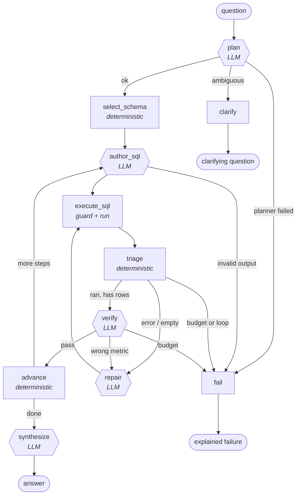

# Architecture

## The system in one sentence

A LangGraph state machine that turns a natural-language question into one or
more SQL queries, runs them against a physically read-only database, reads the
real execution feedback, repairs what fails, verifies that the result actually
answers the question, and refuses to answer when it cannot.

## Graph



Rounded hexagons are LLM calls. Rectangles are deterministic code.
**Eleven nodes: five LLM, six deterministic** (the two terminal nodes,
`clarify` and `fail`, are plain functions).

Topology is asserted in `tests/test_graph_topology.py`, so this diagram cannot
silently drift from the compiled graph.

## Why each node exists

| Node | Kind | Justification |
|---|---|---|
| `plan` | LLM | Decomposition and ambiguity detection genuinely need language understanding. |
| `select_schema` | deterministic | Introspection is a `sqlalchemy.inspect()` call; ranking is token overlap plus FK closure. An LLM would be slower, costlier and less reliable at both. |
| `author_sql` | LLM | Writing SQL from intent is the core language task. |
| `execute_sql` | deterministic | Guard, run, capture. Errors are returned as data so the agent can read them. |
| `triage` | deterministic | Classifies failures for free. Also the only place that can *write* routing decisions — LangGraph routers are read-only. |
| `verify` | LLM | Semantic check: did we measure the right thing? Only runs on results that already executed and returned rows. |
| `repair` | LLM | Rewrites a query given the real failure text. |
| `advance` | deterministic | Commits a step, resets per-step state, resets the loop guard. |
| `synthesize` | LLM | Writes prose over verified results only. |
| `clarify` | deterministic | Terminal. Returns the planner's question. |
| `fail` | deterministic | Terminal. Explains the stop reason; never invents an answer. |

### Nodes that were in the original design and are not here

**Schema Explorer as an agent.** Demoted to `select_schema`. Reading table
names, column types and foreign keys is fully determined by the database.
The judgement call — *which* tables to show — is a ranking problem solved by
lexical scoring plus one-hop foreign-key closure, deterministically, in
microseconds. Spending a model call here would add latency, cost and a new
failure mode for nothing.

**Analysis Planner separate from SQL Author.** Merged. For a single step the
plan *is* the query rationale, so two calls produced one useful output.
Multi-step decomposition still happens, but in `plan`, once per question,
rather than once per step.

**A dedicated "SQL Execution agent".** Executing SQL is a function call. It was
never a plausible agent.

## Why multiple agents at all

The honest answer is that this is not five peers collaborating; it is one
orchestrated pipeline with specialised stages, and the specialisation earns
its place in exactly three ways:

1. **Different tool surfaces.** The verifier reads a *result set*; the author
   reads a *schema*. Giving one prompt both jobs measurably degrades both,
   because the model optimises for whichever it saw last.
2. **The verifier needs to not have written the query.** Asking a model "is
   the SQL you just wrote correct?" gets a yes. Asking a separate call "does
   this result answer this goal?" — with only the goal and the rows, not the
   reasoning that produced them — gets a useful answer. That independence is
   the entire value of the stage.
3. **The repair loop needs external feedback.** The literature is consistent
   that self-correction without an external signal does not reliably improve
   outputs, while self-correction against execution results does. Splitting
   execution from authorship is what makes the signal external.

Everything else that *could* have been an agent is a function, on purpose.

## State

One `TypedDict` (`agentcrew/graph/state.py`) flows through every node. Two rules:

- Nodes return **partial** updates, never whole state. Each node is testable
  by calling it with a hand-built dict and asserting only on keys it owns.
- Non-serialisable collaborators (engine, LLM client, tracer, budget) live in
  `Deps` and are injected by closure, never stored in state. That keeps state
  serialisable, which is what makes checkpointing and the trace panel work.

### Routing

LangGraph routing functions **cannot mutate state** — a mutation inside a
router is silently discarded. This was caught by four failing tests during
development. The fix shapes the current design: every routing decision is
computed in a node, written to `state["next_action"]`, and the routers are
pure projections:

```python
def route_on_next_action(state): return state.get("next_action") or "fail"
```

This is why `triage` is a node and not a routing function.

## Safety: three independent layers

| Layer | Mechanism | Defeated by |
|---|---|---|
| Connection | `file:...?mode=ro` URI + `PRAGMA query_only=ON` | nothing short of editing this file |
| AST | sqlglot parse + full-tree walk, single statement only | nothing; it never sees the driver |
| Resource | injected `LIMIT`, row cap, statement timeout | — |

The connection layer is the real guarantee. If the entire AST guard were
deleted, the agent still could not write, because the handle physically
cannot. The AST layer exists to give the *agent* a clean, explainable error it
can repair from, and to keep the opt-in write mode honest.

Blocked: `DROP`, `DELETE`, `UPDATE`, `INSERT`, `ALTER`, `CREATE`, `TRUNCATE`,
`MERGE`, `PRAGMA`, `ATTACH`, `DETACH`, `VACUUM`, statement batching, and
writes hidden inside CTEs. Verified by 30 tests in `tests/test_safety.py`, and
re-verified at the end of every evaluation run by comparing table checksums
taken before and after.

## Loop control

Three independent stopping mechanisms, all in `agentcrew/graph/control.py` and unit-
tested without a model, database or graph:

1. **Budgets** — attempts per step, total LLM calls, total SQL executions,
   wall clock. Any breach ends the run with an explanation, never a
   fabricated answer.
2. **Fingerprint loop detection** — queries are normalised through sqlglot and
   hashed, so two attempts differing only in whitespace, casing or aliasing
   collide. A repeat does not consume a fresh retry; a second repeat aborts
   the step. This catches the
   `generate → fail → regenerate identical → fail` spiral that a plain retry
   counter would happily run to exhaustion. Measured: the agent stops after
   **2** executions instead of burning the full budget.
3. **Monotonic progress** — a step only advances on a passing verification, so
   a query that runs cleanly but answers the wrong question cannot silently
   terminate the loop.

LangGraph's own `recursion_limit=60` is a backstop. If it ever fires, that is
a bug in the budget logic, not a safety net working as intended.

## Observability

Two sinks, and the split is deliberate:

- **JSONL tracer (always on, local, zero dependencies).** Every node entry and
  exit, tool call, SQL execution, retry, verdict and token count, written to
  `data/traces/run_<id>.json`. This is what the Streamlit trace panel reads.
- **Langfuse (optional, env-gated).** Additive only. If it is disabled or its
  network call throws, the run is unaffected — the sink swallows its own
  exceptions by design.

Core debuggability must never depend on a SaaS being reachable.

## MCP

Evaluated honestly and included in a limited role. MCP adds nothing to the
in-process agent: routing a call through JSON-RPC to reach code in the same
interpreter buys latency and a serialisation boundary for zero capability. So
the graph calls `agentcrew/tools.py` directly.

What MCP does buy is reuse *outside* this process — the same four tools, with
the same read-only guard and row caps, mountable in Claude Desktop or Cursor.
`mcp_server.py` is therefore a thin adapter that delegates to the exact
functions the agent uses, so the two cannot drift.

## Model interface

Every LLM call returns a validated Pydantic object (`schemas.py`). Nothing
downstream parses free text. On a validation failure the model is shown its
own output plus the validation error and asked once to fix it.

This is a deliberate rejection of the "give the model tools and let it loop
until it declares itself done" pattern. **The graph decides what happens next;
the model only decides content.** A model-driven loop can wander, repeat
itself or fail to terminate. A graph-driven loop has a bounded state space you
can unit-test — which is why the offline test suite can cover the repair loop,
the budget logic and the loop detector with no API key at all.
